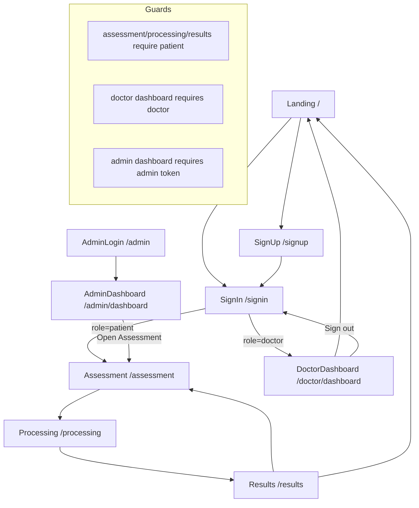

# MindScope Page Functions and Connection Map

## 1) App Architecture Overview

- Framework: React + React Router
- Entry point: src/main.jsx mounts BrowserRouter and App
- Route registry and guards: src/App.jsx
- Data/auth storage: src/services/api.js (localStorage + sessionStorage)

## 2) Route Table (Source of Truth: src/App.jsx)

| Route | Page Component | Access Rule | Notes |
|---|---|---|---|
| / | Landing | Public | Navbar shown |
| /signin | SignIn | Public | Navbar hidden |
| /signup | SignUp | Public | Navbar hidden |
| /admin | AdminLogin | Public | Navbar hidden |
| /admin/dashboard | AdminDashboard | Admin session token required in page logic | Navbar shown |
| /doctor/dashboard | DoctorDashboard | Must be logged in as role=doctor | Guarded in App route |
| /assessment | Assessment | Must be logged in as role=patient | Guarded in App route |
| /processing | Processing | Must be logged in as role=patient | Guarded in App route |
| /results | Results | Must be logged in as role=patient | Guarded in App route |

### Navbar visibility

App hides Navbar on:
- /signin
- /signup
- /admin

Navbar shows on all other routes. For doctor users, the Doctor Dashboard nav item is hidden only on landing page (/).

## 3) Page-by-Page Functions

## Landing (src/pages/Landing.jsx)

Primary responsibility:
- Marketing/onboarding page for PHQ-8 flow.

State + functions:
- openFaq (state): controls active FAQ accordion row.
- toggleFaq(index): opens/closes selected FAQ item.

Outgoing navigation:
- Create Account -> /signup
- Get Started Now -> /signup
- Learn More -> anchor jump to #how-it-works on same page

Incoming navigation:
- Root route /
- Return to Home from Results
- Home links from Navbar

## SignUp (src/pages/SignUp.jsx)

Primary responsibility:
- Register patient or doctor account.

State + functions:
- step: two-step signup (role select, then form)
- role: patient or doctor
- form: all profile fields
- errors/loading: form UX state
- handleChange(field): updates form and clears field-level error
- validate(): role-aware validation (patient vs doctor fields)
- handleSubmit(event): calls registerUser and routes to /signin on success

Data/API calls:
- registerUser(...) from src/services/api.js

Outgoing navigation:
- On success -> /signin
- Existing account button -> /signin

Incoming navigation:
- From landing CTA/buttons
- From SignIn create account link

## SignIn (src/pages/SignIn.jsx)

Primary responsibility:
- Authenticate patient or doctor user and route by role.

State + functions:
- form, errors, loading
- handleChange(field)
- validate()
- handleSubmit(event): calls loginUser and branches by role

Data/API calls:
- loginUser({ email, password })

Outgoing navigation:
- Doctor login -> /doctor/dashboard
- Patient login -> /assessment
- Create one link -> /signup

Incoming navigation:
- From signup success
- Direct route access

## AdminLogin (src/pages/AdminLogin.jsx)

Primary responsibility:
- Authenticate admin account.

State + functions:
- form, errors, loading
- handleChange(field)
- validate()
- handleSubmit(event): calls loginAdmin and routes to admin dashboard

Data/API calls:
- loginAdmin({ adminId, password })
- ADMIN_ACCOUNT displayed as demo credential helper

Outgoing navigation:
- Success -> /admin/dashboard
- Back to Sign In -> /signin

Incoming navigation:
- Direct route /admin

## AdminDashboard (src/pages/AdminDashboard.jsx)

Primary responsibility:
- Show admin metrics for users and assessments.

Core logic/functions:
- session = getAdminSession()
- snapshot = getDashboardSnapshot()
- Guard: if no admin token, Navigate to /admin
- Sign out action clears user session and admin session

Data/API calls:
- getAdminSession()
- getDashboardSnapshot()
- logoutUser()
- localStorage.removeItem('mindscope-admin-session')

Outgoing navigation:
- Unauthorized -> /admin
- Open Assessment -> /assessment
- Sign out -> /admin

Incoming navigation:
- From AdminLogin success

## DoctorDashboard (src/pages/DoctorDashboard.jsx)

Primary responsibility:
- Doctor-facing monitoring dashboard with severity breakdown + recent submissions.

Core logic/functions:
- doctor = getCurrentUser()
- Guard: if missing or role != doctor, Navigate to /signin
- snapshot = getDashboardSnapshot() via useMemo
- recentAssessments: sorted latest 12
- riskBreakdown: grouped by severity levels
- Sign out -> logoutUser + navigate('/signin')

Data/API calls:
- getCurrentUser()
- getDashboardSnapshot()
- logoutUser()

Outgoing navigation:
- Unauthorized -> /signin
- Home button -> /
- Sign out -> /signin

Incoming navigation:
- From SignIn for doctor users

## Assessment (src/pages/Assessment.jsx)

Primary responsibility:
- Run PHQ-8 question flow with voice recording per question.

State + computed values:
- currentQ: current question index
- voiceScores: map of questionId -> 0..3
- recordings: map of questionId -> { blob, previewUrl, durationSeconds }
- score: sum of voiceScores values
- progress, isLast, hasRecording, completedCount, upcomingQuestion

Core functions:
- mapDurationToScore(durationInSeconds):
  - < 15s => 0
  - < 30s => 1
  - < 45s => 2
  - >= 45s => 3
- handleRecordingComplete(blob, previewUrl, durationSeconds): stores recording and score
- handleRecordingCleared(): removes current question recording + score
- handleNext():
  - blocks if no recording
  - if last question: builds assessment payload, saveAssessment(...), stores latestAssessment in sessionStorage, navigates to /processing
  - else advances question index
- handlePrev(): moves back one question when possible

Data/API calls:
- getCurrentUser()
- buildQuestionSet()
- getSeverityLabel(score)
- saveAssessment(payload)
- sessionStorage.setItem('latestAssessment', savedRecord)

Outgoing navigation:
- Final submit -> /processing

Incoming navigation:
- Patient sign in success
- Navbar Start Assessment

## Processing (src/pages/Processing.jsx)

Primary responsibility:
- Simulated multi-step processing screen between Assessment and Results.

State + functions:
- activeStep
- useEffect timer chain increments activeStep based on each step duration
- completion timer redirects to /results

Outgoing navigation:
- Auto redirect -> /results

Incoming navigation:
- From Assessment submit

## Results (src/pages/Results.jsx)

Primary responsibility:
- Render final PHQ-8 score report and recommendations.

Core logic/functions:
- Reads latestAssessment from sessionStorage
- Fallback if missing session data: derives severity from score defaults
- Builds chartData from PHQ8_OPTIONS
- Uses getSeverityDescription(score) for interpretation text
- Formats report date

Data/API calls:
- sessionStorage.getItem('latestAssessment')
- getSeverityLabel(score)
- getSeverityDescription(score)
- PHQ8_OPTIONS

Outgoing navigation:
- Take Another Assessment -> /assessment
- Return to Home -> /

Incoming navigation:
- From Processing auto redirect

## 4) Connection Flow (End-to-End)

## 5) Data and Session Connections

## localStorage keys (src/services/api.js)

- mindscope-users: registered users
- mindscope-assessments: saved assessment records
- mindscope-session: active user session (doctor/patient)
- mindscope-admin-session: active admin session

## sessionStorage keys

- latestAssessment: last submitted assessment payload used by Results page

## Cross-page data movement

1. SignUp writes user to mindscope-users.
2. SignIn writes session to mindscope-session.
3. Assessment writes full result to mindscope-assessments and latestAssessment.
4. Processing does not write data; only transitions UI state and route.
5. Results reads latestAssessment for report rendering.
6. DoctorDashboard and AdminDashboard read aggregated snapshot from users + assessments.

## 6) Important Guard and UX Notes

- Direct navigation to protected routes will redirect unauthorized users to /signin (patient/doctor routes).
- Admin dashboard authorization is validated inside AdminDashboard using mindscope-admin-session.
- If Results is opened without latestAssessment in sessionStorage, UI still renders with fallback values.
- Navbar is hidden on /signin, /signup, /admin and visible elsewhere.

## 7) Potential Improvement Opportunities

- Add route-level guard for /admin/dashboard in App.jsx for consistency with other protected routes.
- Add explicit empty-state warning on Results when latestAssessment is missing.
- Consider storing per-question answer choices directly, not only duration-derived voice scores, if you want strict PHQ-8 parity.
